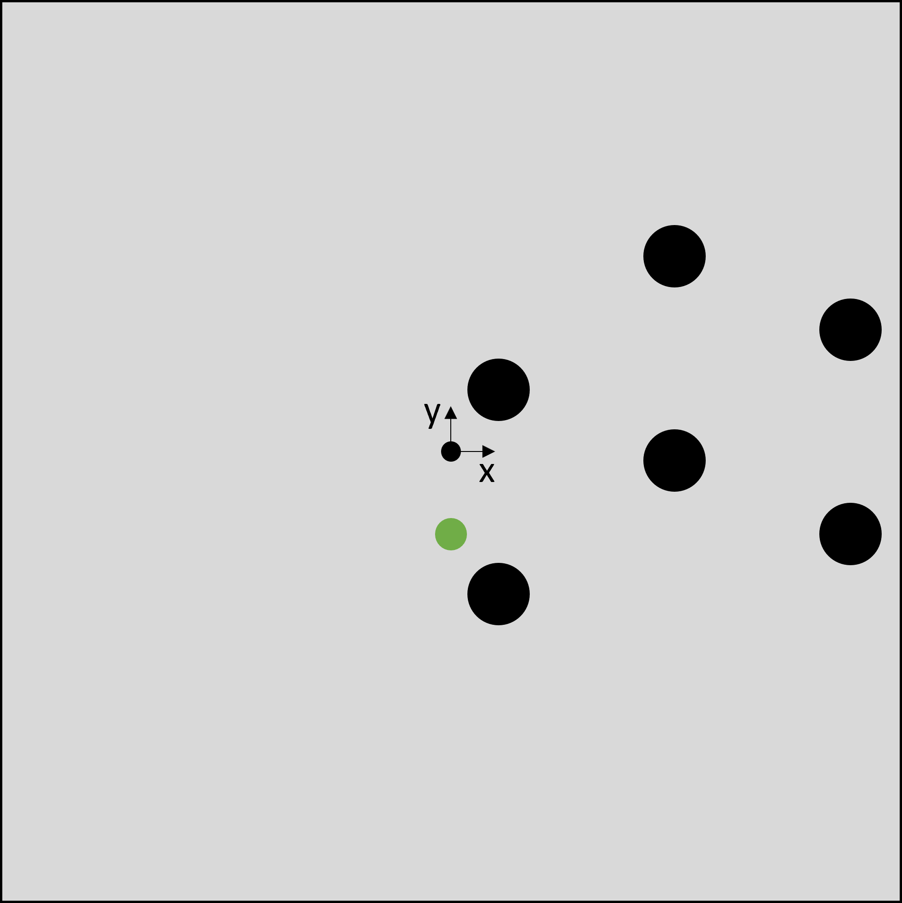
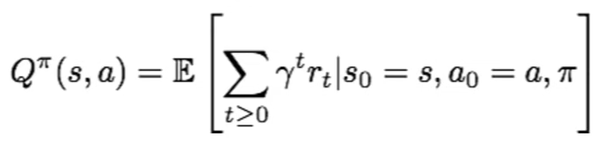
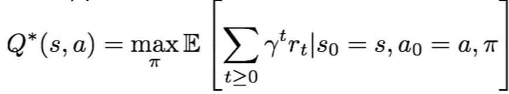
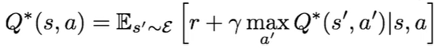
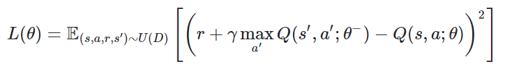
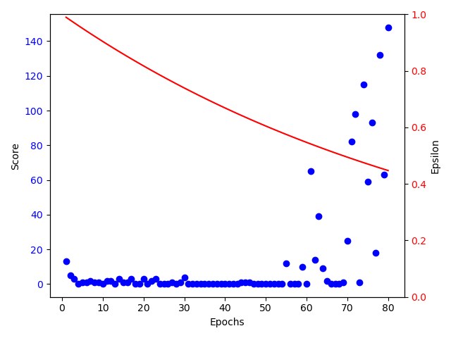
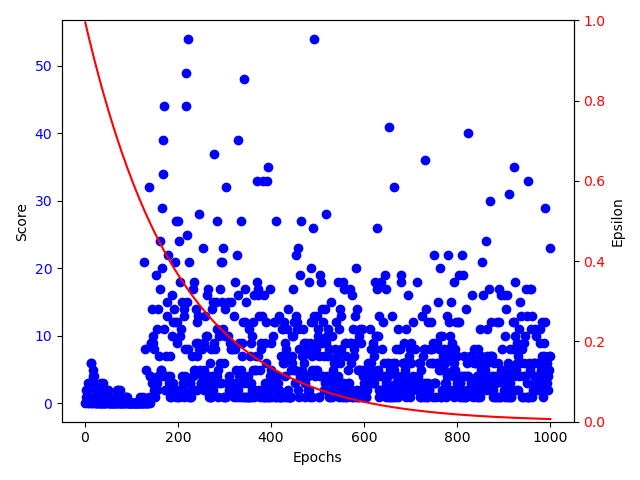
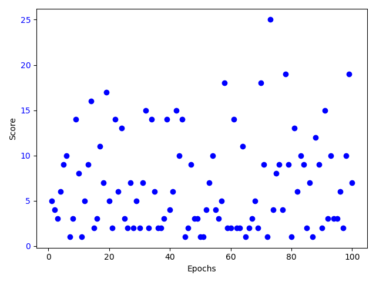
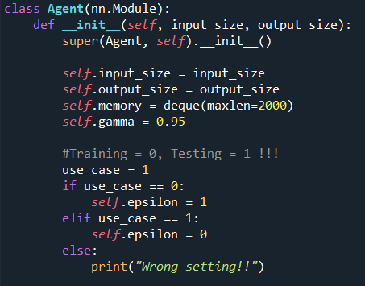

# Hanyang2021_AI_Project

## 1. Introduction
The main target of this project is to train an agent to play the game Flappy Bird using neural networks and Reinforcement Learning (Deep Q Learning).   
  
Flappy Bird tries to pass in between two incoming balls in order to survive and increase the score. Since Flappy Bird moves down constantly, the only available action an agent can choose is a vertical jump. As soon as flappy bird collides with the walls or one of the balls, the game is over. The score is defined by the number of ball pairs Flappy Bird passes.  
In this project, we are going to train a feedforward neural network using the game state information as input, 
the action (jump (1) or don't jump, i.e. do nothing (0)) as output and a reward function. For training the neural network, 
we are going to use backpropagation. The agent is supposed to improve and increase the score troughout training.  
  
  
## 2. Datasets/Game
We use a simple version of the famous game Flappy Bird and adapt the source code to our needs. A pair of two balls with a fixed vertical distance is initialized every 30 frames of the game at the right end of the map. The vertical distance of a pair of balls to the walls is set randomly. Each ball within the game moves 3 pixels to the left each frame. Flappy Bird itself is always located in the horizontal center of the map and falls down 5 pixels each frame. If the action equals 1, the bird jumps up 20 pixels. The whole map consists of 400 x 400 pixels. As soon as Flappy Bird touches either the wall, a ball or the space between one wall and the corresponding ball, it dies. The center of the game map is also the position for the coordinate system.
  
The game map:


  
Sources:   
Game: http://www.grantjenks.com/docs/freegames/flappy.html 
  
  
## 3. Reinforcement Learning / Deep Q Learning

In order to train our agent to play Flappy Bird by itself, we chose to use Reinforcement Learning, and more precisely Deep Q Learning. Reinforcement Learning is one of the three main fields of Machine Learning, alongside supervised and unsupervised Learning.

The working principle of Reinforcement Learning is that there is an agent leaving in an environment. The environment gives the agent a state, in return the agent takes an action, and then the environment provides a numerical reward in response to this action to the agent, as well as its next state. This process is going to be repeated at every step and the goal is to learn how to take the best actions in order to maximize the reward received.

In our case, a state is going to be a set of 6 different variables:
- The y-position of the bird
- The y-position of the lower wall (constant)
- The y-position of the upper wall (constant) 
- The x-position of the closest pair of balls 
- The y-position of the next lower ball (constant)
- The y-position of the next upper ball (constant)
  
All state features are normalized within a range from 0 to 1.
  
The two actions that the bird can take are either to flap or to do nothing.

How can we quantify how good or bad taking a particular action at a given state is? For that, we use what is called a Q-value function, which is why the algorithm we use is called Q Learning. Q(s,a) is the Q-value function, which gives the expected cumulative reward from taking action a in state s. A discount factor γ can be introduced in the cumulative reward formula in order to give more importance to rewards coming in the next steps than steps that are coming later on.



The goal of Reinforcement Learning, and thus of Q learning, is to maximize this sum of cumulative rewards, because we want the agent to perform as good as possible according to our criterias. Since we want the bird to fly as far as possible, we just need to define rewards that are going to strongly penalize the bird’s death, and encourage its survival.

We thus have to find Q*, which is the function giving the maximum expected cumulative reward achievable from a given state-action pair. 



Q* satisfies the Bellman equation, which is the following :



The optimal policy consists in taking the best action at any state as specified by Q*, one way to solve this is with a value iteration algorithm where the Bellman equation is being used as an iterative update. One problem with this method is that we must compute Q(s,a) for every existing state-action pair, which is not possible given that a state is compounded by 6 different variables, so there exists an infinite number of states. A solution for this problem is to use a neural network as a function approximator, the algorithm is then called Deep Q Learning. 

In order to find a function that satisfies the Bellman equation, we want to get as close as possible to the expected reward, for that we define the loss function as following, which is going to be used to train the neural network by backpropagating the loss via gradient descent to the different layers of the deep neural network.



The Q-neural network needs to be trained in order to be performant enough to get close to the expected reward given by the Bellman equation. For that, every transitions from a state to another are kept in a replay memory table, and random batches of transitions are created to train the neural network. This is  because learning from batches of consecutive samples is not efficient and will not lead to good performance since consecutive samples are strongly correlated. This method is called the experience replay method.

Finally, in order to improve the training of the neural network, we define a randomness probability that tells whether the action at a given state is going to be taken by the agent or randomly. This probability ε is initialized at 1 or a number close to 1, then we define a decay smaller than 1, which will be multiplied to the ε at every step. By the end of the learning, ε will reach its minimum value, and almost all of the decisions regarding the next action will be taken by the neural network.

What we just explained is summarized in the following pseudo-code :

```
Initialize replay memory D to size N  
Initialize action-value function Q with random weights  
for episode = 1, M do  
    Initialize state s_1  
    for t = 1, T do  
        With probability ϵ select random action a_t  
        otherwise select a_t=max_a  Q(s_t,a; θ_i)  
        Execute action a_t in emulator and observe r_t and s_(t+1)  
        Store transition (s_t,a_t,r_t,s_(t+1)) in D  
        Sample a minibatch of transitions (s_j,a_j,r_j,s_(j+1)) from D  
        Set y_j:=  
            r_j for terminal s_(j+1)  
            r_j+γ* max_(a^' )  Q(s_(j+1),a'; θ_i) for non-terminal s_(j+1)  
        Perform a gradient step on (y_j-Q(s_j,a_j; θ_i))^2 with respect to θ  
    end for  
end for  
```

Link: https://ai.stackexchange.com/questions/25086/how-is-the-dqn-loss-derived-from-or-theoretically-motivated-by-the-bellman-equ

## 4. Implementation in Python
In this project, three different python scripts are used as a training framework. The first script (Game_Functions) contains the game itself. It receives an action and computes the new state and the reward. Another script (Agent) contains the class of the agent. In general, it gets the current game state (normalized features) and attempts to predict the most suitable action. Moreover, it stores the data for the replay memory. The thrid script (Main_Control) calls the other two scripts alternately and contains the training of the AI agent. 
  
In order to initialize and train the agent's neural network, we use the Machine Learning framework Pytorch. We define a neural network with 6 nodes in the input layer, 24 nodes within two hidden layers each and two nodes in the output layer. Output 0 equals doing nothing, output 1 is related to the action jump. The agent checks which output has the higher value/probability to receive a maximum positive reward and chooses the corresponding action. We use a dynamic learning rate that is divided by 10 for each time the agents reaches the maximum score. Every time this happens, the value for the maximum score itself gets increased by a certain number. The loss for the training of the neural network is calculated as described in chapter 3. As a loss function, the Mean Squared Error (MSE) is applied. Furthermore, we use the Adam algorithm as an optimizer. Before backpropagation is performed on the computed loss, the old gradients are set to zero. The backpropagation algorithm then calculates the new gradients on the current loss. Using gradient descent, the neural network's values for weights and biases are updated subsequently. For each training epoch, a batch of samples from the replay memory is used.
    
The AI agent gets a positive reward of 1 for passing a pair of balls and a negative reward of -10 for dying because of crashing. In order to speed up the training process, the agent also gets a small positive reward for being vertically close to the center of the next pair of balls and a small negative reward for being too far away.  
      

We have taken the following source as a guideline for the implementation of our framework.

Source:   
DQN: https://github.com/the-deep-learners/TensorFlow-LiveLessons/blob/master/notebooks/cartpole_dqn.ipynb


## 5. Evaluation and Analysis  
We basically trained the AI agent within two different game setups. The first setup can be considered as a very easy game, the second is more difficult since the vertical distance between two balls is reduced. We have made slight changes on the reward function, the learning rate and epsilon. The rest of the code remains unchanged.

- Easy Game:  
The training of the AI agent for the easy game can be taken from the following image.



In the beginning, it's difficult for the AI agent to learn something meaningful. After a certain number of epochs, it reaches the maximum score number for the first time. The neural network is saved several times within the next epochs, the maximum score number increases and the learning rate decreases. One can clearly see the improvement of the AI agent trough training. Moreover, the plot contains the epsilon value for the current state, which decreases over the epochs. 

The neural network that is saved last is then used for testing the AI agent within the easy game. As a result, the easy game can be played endless.


https://user-images.githubusercontent.com/92134911/143967696-249a0b24-6c30-4693-8608-60f41a1c3ebc.mp4


- Difficult Game:  
The training of the AI agent for the difficult game can be taken from the following image.  



One can see that training improves the AI agent in the beginning. After a certain number of epochs, its performance decreases. In this case, the neural network that provides the highest score is saved and used to test the AI agent within the difficult game setup. The results can be taken from the following figure.  



In this case, the game can not be played endless, but reaches a maximum score of 25. From this, it can be concluded that the AI agent still learns something meaningful during training. 


https://user-images.githubusercontent.com/92134911/143968297-7f640a86-93b7-44f5-b8b9-6f372bd3527f.mp4


## 6. Conclusion  
After testing both game setups, one can clearly say that in both cases, the AI agent at least learnt something meaningful. For the easy game, the agent basically just has to stay in the vertical center of the map and slightly adjusts his hight. This might be the reason why it's pretty easy for the agent to play the game endless. For the difficult game setup, the AI agent has to move more. It has particular problems when it misses the time to jump after a long drop to a deeper pair of balls, causing it to crash into the lower of the two. It might be possible that a specific parameter setting or another structure of the neural network enables a better training using the same algorithm. One can also consider using the entire game map as an input state to the agent instead of the 6 features that are related to different positions. It would then also be necessary to use a convolutional neural network. Nevertheless, the main goal of this project is achieved, since we can provide a framework that trains an AI agent to play the game Flappy Bird.  
  
  
## 7. How to train/test agent
To train and test the AI agent, all four scripts have to be in the same folder. For training, one only has to run the "Main_Control" script. In this case, the AI agent class must be set to training mode. This mode uses the epsilon parameter to perform random actions to explore the environment during training. This randomness has to be switched of for testing to give the neural network the control over all actions. For this purpose, the "use_case" parameter in the "Agent" script has to be set. 
  
So for training, one has to run the "Main_Control" script and set the "use_case" parameter to 0. For testing, one has to run the "Game_Play_By_Agent" script and set the "use_case" parameter to 1. The four scripts within this documentation are for the easy Flappy Bird game.
  


