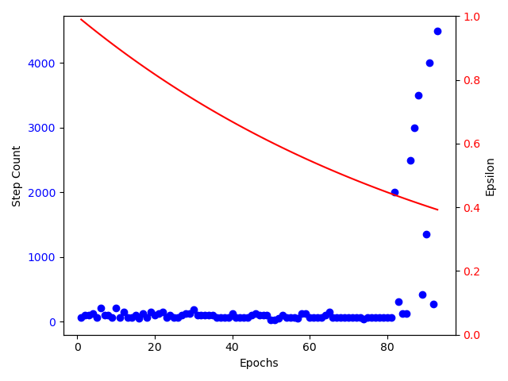

# Hanyang2021_AI_Project

## 1. Introduction
The main target of this project is to train an agent to play the game flappy bird using neural networks and reinforcement learning (deep q learning).   
  
Flappy Bird tries to pass in between two incoming balls in order to survive and increase the score. Since flappy bird moves down constantly, the only available action an agent can choose is a vertical jump. As soon as flappy bird collides with the walls or the balls, the game is over. The score is defined by the number of ball pairs flappy bird passes.  
  
In this project, we are going to train a feedforward neural network using the game state information as input, 
the action (jump (1) or don't jump, i.e. do nothing (0)) as output and a reward function. For training the neural network, 
we are going to use backpropagation. The agent is supposed to improve and increase the score troughout training.  

Sources: 
Game: http://www.grantjenks.com/docs/freegames/flappy.html  
DQN: https://github.com/the-deep-learners/TensorFlow-LiveLessons/blob/master/notebooks/cartpole_dqn.ipynb

## 2. Datsaets/Game

## 3. Reinrorcement Learning/Deep Q Learning

State, Action, Reward, Greedy Policy, Epsilon, Epsilon Decay, Replay Memory, Batch Size, Bellman Equation, Q-Learning, Difference to Deep Q Learning, 

L(θ)=E(s,a,r,s′)∼U(D)[(r+γmaxa′Q(s′,a′;θ−)−Q(s,a;θ))2]

Link: https://ai.stackexchange.com/questions/25086/how-is-the-dqn-loss-derived-from-or-theoretically-motivated-by-the-bellman-equ

## 4. Implementation in Python
In this project, three different python scripts are used for the training framework. The first script (Game_Functions) contains the game itsself. It's recieves an action and basically computes the new state and the reward. Another script (Agent) contains the class of the agent. In general, it gets the current game state and attempts to predict the most suitable action. Moreover, it stores the data for the replay memory. The thrid script (Main_Control) calls the other two scripts alternately and contains the training of the agent.
  
The algorith basically looks like this:  

  initialize game  
  initialize agent  
  for i in range(n_episodes)  
      get initial state  

      while bird_dead == False:
        action = agent(state) || f(random)
        replay_memory_data (e.g. reward) = game(action)

        if (score > max_steps) & (epsilon < 0.6)
          save nn
          learning_rate *= 0.1
          max_steps += XX

      training_data = random.sample(memory)
      prediction = agent(training_data)
      loss = lossf(target, prediction) 

      agent.optimizer.zero_grad() 
      loss.backward() 
      agent.optimizer.step()
    
 
      

## 5. Evaluation and Analysis

## 6. Conclusion

