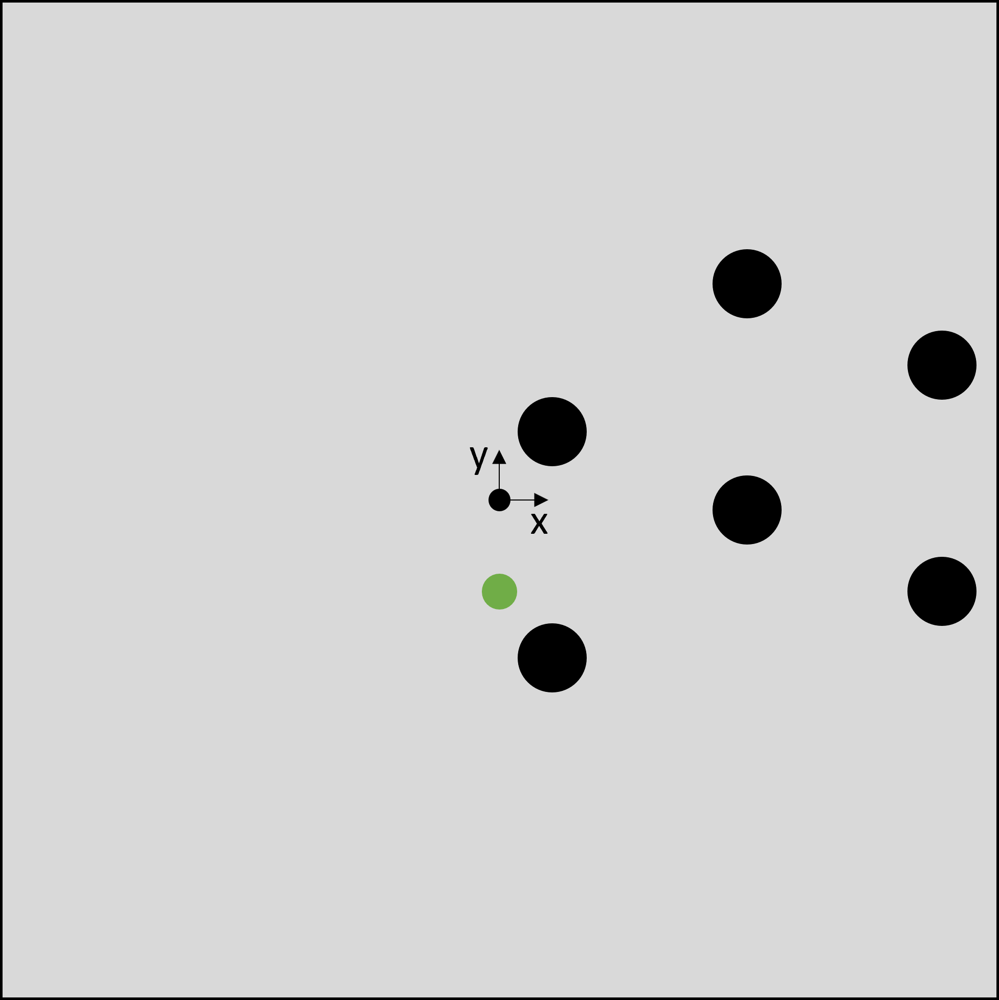

# Hanyang2021_AI_Project

## 1. Introduction
The main target of this project is to train an agent to play the game flappy bird using neural networks and reinforcement learning (deep q learning).   
  
Flappy Bird tries to pass in between two incoming balls in order to survive and increase the score. Since flappy bird moves down constantly, the only available action an agent can choose is a vertical jump. As soon as flappy bird collides with the walls or one of the balls, the game is over. The score is defined by the number of ball pairs flappy bird passes.  
In this project, we are going to train a feedforward neural network using the game state information as input, 
the action (jump (1) or don't jump, i.e. do nothing (0)) as output and a reward function. For training the neural network, 
we are going to use backpropagation. The agent is supposed to improve and increase the score troughout training.  

Sources:   
DQN: https://github.com/the-deep-learners/TensorFlow-LiveLessons/blob/master/notebooks/cartpole_dqn.ipynb


## 2. Datsaets/Game
We use a simple version of the famous game Flappy Bird and adapt the source code to our needs. A pair of two balls with a fixed vertical distance is initialized every 30 frames of the game at the right end of the map. The vertical distance of a pair of balls to the walls is set randomly. Each ball within the game moves 3 pixels to the left each frame. Flappy Bird itsself is always located in the horizontal center of the map and falls down 5 pixels each frame. If the action equals 1, the bird jumps up 20 pixels. The whole map consists of 400 x 400 pixels. As soon as Flappy Bird touches either the wall or a ball, it dies. The center of the game map is also the position for the coordinate system.
  
The game map:
  

  
Sources: 
Game: http://www.grantjenks.com/docs/freegames/flappy.html 
  
## 3. Reinrorcement Learning/Deep Q Learning

In order to train our agent to play Flappy Bird by itself, we chose to use Reinforcement Learning, and more precisely Deep Q Learning. Reinforcement Learning is one of the three main fields of Machine Learning, alongside supervised and unsupervised Learning.

The working principle of Reinforcement Learning is that there is an agent leaving in an environment. The environment gives the agent a state, in return the agent takes an action, and then the environment provides a numerical reward in response to this action to the agent, as well as its next state. This process is going to be repeated at every step and the goal is to learn how to take the best actions in order to maximize the reward received.

In our case, a state is going to be a set of 5 different variables:
-
-
-
-
-

The two actions that the bird can take are to flap or to do nothing.

How can we quantify how good or bad taking a particular action at a given state is? For that, we use what is called a Q-value function. Q(s,a) is the Q-value function, which gives the expected cumulative reward from taking action a in state s. 
A discount factor gamma can be introduced in the cumulative reward formula in order to give more importance to rewards coming in the next steps than steps that are coming later on.
The goal of Reinforcement Learning, and thus of Q learning is to maximize this sum of cumulative rewards, because we want the agent to perform as good as possible according to our criterias, in other words we want the bird to fly as long as possible without hitting a ball. In order to achieve that, we need to find Q*, which is the function giving the maximum expected cumulative reward achievable from a given state-action pair. Q* satisfies the Bellman equation. The optimal policy consists in taking the best action at any state as specified by Q*, one way to solve this is with a value iteration algorithm where the Bellman equation is being used as an iterative update.

One problem with this method is that we can must compute Q(s,a) for every existing state-action pair, which is not possible given that a state is compounded by 5 different variables. A solution for this problem is to use a neural network as a function approximator, the algorithm is then called Deep Q Learning. In order to find a function that satisfies the Bellman equation, we want to get as close as possible to the expected reward, for that we define the loss function as following, which is going to be by backward passed via gradient update to the different layers of the deep neural network.

L(θ)=E(s,a,r,s′)∼U(D)[(r+γmaxa′Q(s′,a′;θ−)−Q(s,a;θ))2]

The Q-neural network needs to be trained in order to be performant enough to get close to the expected reward given by the Bellman equation. For that, every transitions from a state to another are kept in a replay memory table, and random batches of transitions are created to train the neural network. The reason for that is the experience replay method : learning from batches of consecutive samples is unefficient and will not lead to good performance because consecutive samples are strongly correlated.

Finally, in order to improve the training of the neural network, we define a randomness probability that tells wether the action at a given state is going to be taken by the agent or randomly. This probability epsilon is initialized at 1 or a number close to 1, then we define a decay smallert than 1, which will be multiplied to the epsilon at every step. By the end of the learning, the epsilon will reach its minimum value, and almost all of the decisions regarding the next action will be taken by the neural network.

```
Initialize replay memory D to size N  
Initialize action-value function Q with random weights  
for episode = 1, M do  
    Initialize state s_1  
    for t = 1, T do  
        With probability ϵ select random action a_t  
        otherwise select a_t=max_a  Q(s_t,a; θ_i)  
        Execute action a_t in emulator and observe r_t and s_(t+1)  
        Store transition (s_t,a_t,r_t,s_(t+1)) in D  
        Sample a minibatch of transitions (s_j,a_j,r_j,s_(j+1)) from D  
        Set y_j:=  
            r_j for terminal s_(j+1)  
            r_j+γ* max_(a^' )  Q(s_(j+1),a'; θ_i) for non-terminal s_(j+1)  
        Perform a gradient step on (y_j-Q(s_j,a_j; θ_i))^2 with respect to θ  
    end for  
end for  
```

**State, Action, Reward**, Greedy Policy, Epsilon, Epsilon Decay, **Replay Memory, Batch Size, Bellman Equation, Q-Learning, Difference to Deep Q Learning**, 

Link: https://ai.stackexchange.com/questions/25086/how-is-the-dqn-loss-derived-from-or-theoretically-motivated-by-the-bellman-equ

## 4. Implementation in Python
In this project, three different python scripts are used for the training framework. The first script (Game_Functions) contains the game itsself. It's recieves an action and basically computes the new state and the reward. Another script (Agent) contains the class of the agent. In general, it gets the current game state and attempts to predict the most suitable action. Moreover, it stores the data for the replay memory. The thrid script (Main_Control) calls the other two scripts alternately and contains the training of the agent.
  
The algorith basically looks like this:  
  
  import packages
  initialize game  
  initialize agent  
  for i in range(n_episodes)  
      get initial state  

      while bird_dead == False:
        action = agent(state) || f(random)
        replay_memory_data (e.g. reward) = game(action)

        if (score > max_steps) & (epsilon < 0.6)
          save nn
          learning_rate *= 0.1
          max_steps += XX

      training_data = random.sample(memory)
      prediction = agent(training_data)
      loss = lossf(target, prediction) 

      agent.optimizer.zero_grad() 
      loss.backward() 
      agent.optimizer.step()
    
 
      


## 5. Evaluation and Analysis

## 6. Conclusion


